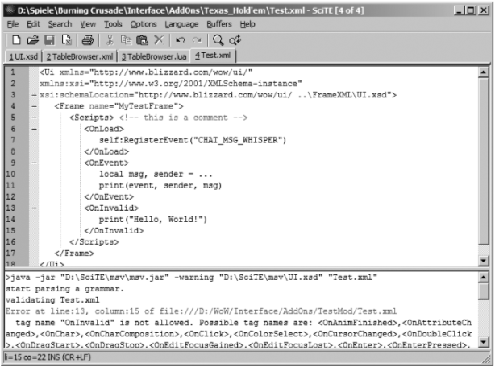

# Chapter3 使用wow api创建一个Helloworld模块

让我们开始吧。你已经在第二章节当中见识了一些lua示例，所以编写一个helloworld模块对你来说应当不成问题。但是第
一个示例模块仅仅是展示出"hello,world."。它将由两个斜杠命令组成: /hwadd <id> <text>和/hwshow <id>.前一条
指令将字符串存放在table当中，后者将这段存放在id下的字符串输出至对话管道。奸商可能认为这个插件唯一的作用就是散布一
些交易广告，它让你使用一个宏发送一大堆的文字。另一个用途在于事先使用一个简单的宏存储一些boss战或者竞技场当中需要使
用到的指令，然后在raid或者战场当中使用它们。让我们在游戏当中运行一段lua脚本。

## 在wow里运行一个helloworld

运行一个类似于我们刚刚创建的脚本，只需要在命令行当中输入以下斜杠命令    
`/script print("hello,world!")`    
`/script <text>`命令将文本<text>编译成一个新的代码块然后执行它。

---
    NOTE: 一个chunk就是一段lua代码拥有独立的作用域。所以如果你再 /script 命令当中定义变量的是一个局部变量，
    该变量在其他的/script 命令当中是不可见的。

---

你已经了解了print函数，不过这里和标准lua有一些小的区别。WOW将输出默认输出在对话框而非计算机当中的标准输出。所以
helloworld将在你的对话框当中进行呈现。就这么简单？是的，最基本的脚本就是这样。不过这是一个最简单的宏风格的脚本，并且
我向你保证你将会学会如何编写wow的插件，那么让我们编写一个真正的插件。刚才的这个实例只是像你展示在wow当中的lua和普通
的lua并没有什么区别。现在我们可以开始创建一个lua脚本，作为一个真正的插件在游戏启动时被加载。

## 我们第一个wow插件

让我们开始创建在本章节开始的时候描述的那个插件。在我们开始创建这个插件之前，我们首先需要明确我们要将我们的lua
文件放在哪里。

### 文件夹的结构

可能你已经知道将插件放入魔兽世界 *Interface\AddOns*文件夹使之生效。这个文件夹所在绝对路径可能为
*C:\Program Files\World of Warcraft\Interface\AddOns*。让我们在该路径下创建一个HelloWorld文件夹。在这里存放
所有我们HelloWorld插件所需要的所有文件。你是否注意到AddOns文件夹下有各式各样后缀的文件？哪一种文件类型是被插件所使用
的？魔兽世界提供一些api用于处理如下类型的文件:lua脚本(.lua)，XML(数据定义语言，你将会在第五章节学习它们)，图片相关的
文件(.tga和.blp),音频文件(.wav和.mp3),字体文件(.ttf)和3d模型(.m2)。你可以在自己的插件中使用所有魔兽世界客户端所
自带的以上资源文件，包括背景音乐，文本，图片，模型等等。如果这些还不能使你满足，你还可以提供数据自己的声音，图片等等文件
在插件中。魔兽世界API提供了一个虚拟的文件系统，让你可以像使用本地文件一样使用远程的文件。这允许你使用所有的Interface
文件夹下的文件以及MPQ包当中的资源文件。

---
    NOTE: MPQ是一种暴雪游戏的文件格式。可以将它想象成一个zip压缩包。你将在后续的章节了解更多有关于MPQ包的内容
---

虚拟文件系统在你启动客户端的时候创建，所以在你重启它之前，是无法识别新的文件的。无论何时你添加了新的文件，你必须重启
游戏；简单的重新加载你的插件(使用 /reload 或者 /script ReloadUI())无法是新增的文件生效。
MPQ包同样包含了一些lua和用于定义默认UI的xml文件。整个游戏当中的UI都是通过类似lua插件的形式编写的。在本章节晚些时候
你将了解到如何查看这些默认UI的代码。在编写插件时，所有的文件路径都采用相对于魔兽世界根目录的路径，并且MPQ包当中的文件将
被映射至魔兽世界根目录。你无法访问魔兽世界根目录以外的任何文件。所以一个音频文件的路径可以如下所示:

*Interface\AddOns\yourMod\sounds\something.mp3*  
或者这样:  
*Sound\Creature\Illidan\BLACK_Illidan_04.wav*

以上第一个音频文件存放在了插件所在路径，第二个音频文件是存放在MPQ包*expansion-speech-locale.mpq*当中。
(在后面的章节当中你将会学习到如何浏览和解压MPQ包当中的文件)播放一段音乐是一个很好的有关于使用文件路径的示例，那么
我们赶紧尝试一下。魔兽世界提供了一个函数供我们根据文件路径进行音乐播放:*PlaySoundFile(file)*。使用以下命令尝试一下:
    
`/script PlaySoundFile("Sound/Creature/Illidan/BLACK_Illidan_04.wav")`  

你会听到伊利丹著名的"You are not prepared!" 但是实际上伊利丹并没有出现。

---
    NOTE: 一旦你可以从Interface\AddOns路径中运行音频文件，那么写一个游戏当中的mp3播放器将变得非常容易。你只需要将mp3文件
    拷贝到该目录当中，然后提供一个插件用于获取这些mp3文件路径(例如可以用table保存，魔兽世界没有提供一个用于遍历文件夹下文件的
    函数)。例如你可以将mp3文件放在Interface\AddOns\MyMusic文件夹中，然后运行以下命令

`/script PlaySoundFile("Interface/AddOns/MyMusic/MyFavoriteSong.mp3")`  

---

插件的运行除了需要执行我们编写的lua脚本之外，我们需要告诉游戏如何执行我们的lua脚本。同时我们还需要提供一些额外
的和我们插件相关的信息，例如插件的名称等等。描述插件信息的文件被称作*TOC*文件。让我们看看这是个什么样的文件
    
### TOC文件格式

一个TOC文件(table of contents)包含元数据，用于描述插件当中哪些lua脚本和XML文件需要被加载。这里有一些基本的
属性例如插件的名称以及插件所支持的魔兽世界版本。另外也可以自定义一些属性用于存储一些数据在TOC文件当中。让我们为我们的
helloworld插件编写一个TOC文件。
    
---
    NOTE: 魔兽世界仅仅在游戏开始时读取一次TOC文件。所以任何.toc文件相关的修改都需要重启游戏进行生效。

---

我们已经在Interface\AddOns下创建了HelloWorld文件夹，让我们在这里创建一个TOC文件。魔兽世界尝试加载与文件夹同名的TOC文件
所以我们创建一个HelloWorld.toc的文件，内容如下:  
```  
## Interface: 30100  
## Title: Hello,World!  
## Title-deDE: Hallo,Welt!  
## Notes: The best "Hello, World" addon!  
HelloWorld.lua
```  
     
在TOC文件中有两种指令，由\#\#开始的行包含了元数据信息，其他的行定义了一些插件被加载时所需要执行的文件  
我们为插件定义了如下元数据：
     
`Interface = 30100`
     
上面这一行告诉游戏我们的插件支持魔兽世界3.1.X版本。如果该版本低于当前游戏版本，魔兽世界将会提示该插件已过期或者不兼容

`Title = Hello,World!`
     
这一行定义了我们插件的名称。所以在游戏插件列表中你将看到一个名为"Hello,World!"的插件

`Title-deDE = Hallo,Welt!`
    
这是一个本地化的示例。这一行代码只在德语客户端当中被执行。它将覆盖之前我们所定义的Title属性，在德文客户端中我们的
插件名称为"Hallo,Welt!"。你可以在元数据当中定义任意的地区信息去做插件本地化的适配。一个本地化信息包括了一个语言码附
加一个地区码，所以deDE的全称为German-Germany(德语，德国)。默认的英语客户端为enUS,除非你使用欧洲版本的客户端。
    
`Notes = The best "Hello,World!" addon`
    
这将在插件的小提示当中被呈现出来。
除此之外还有很多的元数据属性被魔兽世界所识别，如下表
    
**Table 3-1.** *AvailableMetadataAttributes*   

| Metadata      | Description          |
| ------------- | -------------------- |
| Interface     | 插件所支持的游戏版本     |
| Title         | 插件名称               |
| Notes         | 插件详细信息               |
| RequiredDeps         | 使用逗号分隔的一个插件名称列表<br>该插件将在所依赖的插件加载完毕之后加载<br>如果依赖插件缺失或者被禁用，该插件将不会被加载 |
| OptionalDeps         | 使用逗号分隔的一个插件名称列表，如果他们存在并启用了将会优先此插件进行加载|
| LoadOnDemand         | 0(默认)或者1。意为延迟加载。延迟加载插件不会在游戏启动时加载<br>你可以使用LoadAddOn(*addon*)函数进行手动加载         |
| LoadWith             | 在LoadOnDemand属性值为1时生效<br>使用逗号分隔的一个插件名称列表，当列表中任一插件被加载时，加载本插件                 |
| LoadManagers         | 使用逗号分隔的一个插件名称列表，当任一插件被启用时，LoadOnDemand属性值将被自动设置为1               |
| SavedVariables       | 使用逗号分隔的一个全局变量列表，用户登出游戏时，将会存储这些变量在目标路径<br>*\WTF\Account\<account name>\SavedVariables\<addon>.lua* |
| SavedVariablesPerCharacter         | 和SavedVariables变量类似，分角色进行存储，路径如下<br>*\WTF\Account\<account name>\<server>\<character>\SavedVariables\<addon>.lua*               |
| DefaultState         | enable或者disabled 插件默认启动状态              |
| Secure               | 1或者0。由暴雪签名的安全性插件。目前无法获取暴雪爸爸的签名，<br>所以该属性被暴雪自身插件所保留             |

你也可以自定义一些元数据相关的属性，但是这些属性名称必须以X-开头。API函数GetAddOnMetadata(*addon,attribute*)
可以用于获取这些属性。请注意该方法同样可以获取尚未被加载的插件模块的属性。所以TOC文件可以用于指定延迟加载的插件在何时被真正加载。
你不需要为元数据添加本地化信息，它将被自动本地化。

让我们看一个更完整的实例。DBM插件当中的永恒之眼副本模块TOC文件使用了很多自定义元数据属性:
```
## Interface:30100
## Title: <DBM> Eye of Eternity
## Title-deDE:<DBM> Auge der Ewigkeit
## LoadOnDemand:1
## RequiredDeps:DBM-Core
## SavedVariables::DBMEyeOfEternity_SavedVars,DBMEyeOfEternity_SavedStats
## X-DBM-Mod:1
## X-DBM-Mod-Category:WotLK
## X-DBM-Mod-Name:Eye of Eternity
## X-DBM-Mod-deDE:Das Auge der Ewigkeit
## X-DBM-Mod-Sort:3
## X-DBM-Mod-LoadZone:The Eye of Eternity
## X-DBM-Mod-LoadZone-deDE: Das Auge der Ewigkeit
localization.en.lua
localization.de.lua
Malygos.lua
```

我删除了德语之外的本地化信息，真实的文件包含很多本地化的内容  
此文件定义了所有DBM在加载永恒之眼模块之前，所需要的一系列元数据信息。最重要的属性就是X-DBM-Mod-LoadZone，
它通知DBM插件在你进入一个特殊的区域时加载该模块。这是DBM插件懒加载的关键所在。元数据的强大之处在于某一个模块被家在
之前，它的元数据属性就已经可以被访问。  
我们已经创建了TOC文件，现在我们现在需要添加lua脚本做一些更cool的事情了。魔兽世界提供给我们一系列函数供我们
调用魔兽世界接口。
    
### 使用魔兽世界API

我们已经了解过一些API函数:print,PlaySoundFile.LoadAddOn,GetAddOnMetadata。所有这些函数都是全局函数，所以可以再任意地方
使用它们:在lua脚本当中，xml文件当中(可以封装lua代码，在第五章节讲述)，以及命令行里。从这些函数的名称以及参数的名称我们很容易知道
他们的用途。你可以在WowWiki网站中找到完整的函数列表 http://www.wowwiki.com/API 。本书中不会将他们列举出来有两个原因:因为这
实在是太长了，另一个原因是因为函数可能因为魔兽世界版本的升级而发生变化。所有在第二章节中讲述的lua原生方法都是可用的，除非有额外的
声明(如系统函数，系统IO函数)。

在所有的函数当中也有类型的区分。大部分公用的函数是"真正的"API,使用C语言进行编写可供lua进行调用。一个示例就是PlaySoundFile()
函数。在默认UI当中，没有lua文件定义了这个函数。这个函数直接由底层接口API提供，这部分函数在大部分场景当中无法使用lua对其重新进行
实现。

除此之外你可以在默认UI的lua文件当中找到很多的函数，大部分函数由UI开头，例如UIFrameFadeOut(frame,time)函数，使得某一个UI模块
在一定时间内渐隐(逐步递减它的阿尔法值)。

你是否还记得我们曾经使用过`/script <lua code>`在游戏中执行lua命令。首先我们使用这个方式来调用这个API函数，看看他是怎样工作的。
例如，你可以使用以下的参数测试UIFrameFadeOut函数:

`/script UIFrameFadeOut(Minimap,1)`

你的小地图将在1秒钟之后消失了。怎么样让它重新显示在屏幕上？全局变量Minimap具体是怎样实现的？

这样我们进入了下一个类型的API函数:需要通过对象调用的api函数。所有的框(屏幕上可见的一个东西，例如一个小地图，一个动作栏，
一个按钮等等)都是对象；可以使用CreateFrame(*frameType*)或者xml文件创建他们。你将会在第五章节学习如何创建他们，已经有哪些框
类型可以供我们使用。一个框本质上是由一系列userdata值和一些列方法构成的table。回顾一下我们是如何使用冒号操作符调用一个方法，这些
方法的本质就是存放在table当中的一些基本的函数。一个框包含很多的方法。所以第三方提供的API函数是绑定在框当中的，在调用时需要使用
冒号操作符。让我们调用一些框相关的函数，他们和用户视图界面元素密切相关。
*(本节作者想要表达的最基本含义就是frame相关的函数并非类似于print等全局函数，他们需要通过frame对象加:函数名进行调用)*

现在我们看一下最基本的通过对象调用的api函数。你将在未来的两个章节当中学习到更多有关框以及面向对象相关的内容。让我们看一个对于所有
框都有效的函数:SetAlpha(*value*)，该函数用于设置边框的透明度(0到1之间)。所有这种函数使用冒号进行调用。让我们尝试一下将小地图
重新展示在界面上:

`/script Minimap:SetAlpha(1)`

另一个可用的函数GetAlpha(),通过它获取一个对象当前的阿尔法值。你可以在附录A当中查询所有有关框的函数。

回到我们HelloWorld模块。我们的插件目前已经具备了被魔兽世界所识别的能力:拥有了定义元数据的TOC文件。现在我们需要将我们的lua代码
添加到我们的插件当中用于调用魔兽世界所提供的API函数。我们在TOC文件里已经定义了我们lua脚本的名称为HelloWorld.lua。当加载
HelloWorld插件时，魔兽世界尝试在HelloWorld文件夹中查找HelloWorld.lua文件。让我们创建该文件。


| 重新启动和编辑已有文件      |
| ------------- | 
| 之前曾经介绍过你需要在插件当中新增新的文件之后重新启动游戏使之生效。<br>不过假如你修改一个已经存在的文件，你不需要重新启动整个游戏，只需要键入<br>`/console reloadui`<br>重新加载先前已经载入的文件     |

## 创建自己的命令
自定义一个命令其实很容易。魔兽世界提供了一个table变量用于存储所有的命令处理函数，它就是全局变量SlashCmdList。命令的处理函数和
命令是绑定在一起的，例如 `/hwadd`命令。这个命令处理函数将在用户每一次键入命令时所调用。处理函数接受一个字符串作为自己的方法参数。
所以键入`/hwadd test string`会触发处理函数的调用，入参为"test string"这样一个字符串。

完成本章节初所描述的插件，我们需要两个命令：第一个命令用于存储一个新的字符串另一个命令用于将存储的字符串输出到对话框。自定义一个
命令分为两个步骤。

第一步，选择一个标识符作为我们命令的唯一标识作为key存储在SlashCmdList当中。我们/hwadd命令的标识符为
HELLO_WORLD_ADD，我们的命令处理函数将与这个key进行关联。除此之外我们需要将用户键入的命令与这个key进行关联(此处我们为用户两种
输入同时绑定到这个key: /hwadd 以及 /helloworldadd,也就是说用户无论键入哪一个命令，都会关联到HELLO_WORLD_ADD这个key，
从而关联到同一个命令处理函数，即这两个命令是完全等价的)我们可以使用全局变量将用户键入命令与key进行绑定。全局变量的名称被限定为
SLASH_identifier1 to SLASH_identifierN。

第二步，将命令处理函数与上面我们选择的标识符绑定在SlashCmdList当中。这个函数拥有一个参数，即我们刚刚提到的用户输入的命令之后的
字符串。既然我们需要定义两个命令，那么我们自然也需要定义两个命令处理函数。代码非常的简单。

如果你还没有创建HelloWorld.lua,那么现在创建它，并且将如下的代码添加到文件当中。

``` lua
-- 用于存储用户添加的需要反复使用的文本，以键值对的形式保存
HelloWorld_Test = {}

-- 定义目标输出的形式，可以更改为raid，战场，大喊，工会等等，可选值如下
-- SAY,YELL,EMOTE,WHISPER,PARTY,RAID,BATTLEGROUND,RAID WARNING,GUILD or OFFICER
local channel = "SAY"

-- 将用户命令与标识符HELLO_WORLD_ADD进行绑定，可以绑定多个用户键入命令
SLASH_HELLO_WORLD_ADD1 = "/hwadd"

-- 将用户命令与标识符HELLO_WORLD_ADD进行绑定，可以绑定多个用户键入命令
SLASH_HELLO_WORLD_ADD2 = "/helloworldadd"

-- 定义命令处理函数，与标识符HELLO_WORLD_ADD进行绑定，存储在全局变量SlashCmdList当中
SlashCmdList["HELLO_WORLD_ADD"] = function(msg)
    --将用户的输入根据正则格式化，前半部分为key，后半部分为文本
    local id,text = msg:match("(%S+)%s+(.+)")
    if id and text then
        --如果格式化成功，则将key value存放在HelloWorld_Test table当中，供show函数使用
        HelloWorldText[id:lower()] = text
    else
        --如果格式化不成功，告诉用户如何使用这个命令
        print("Usage: /hwadd <id> <text>")
    end
end


SLASH_HELLO_WORLD_SHOW1 = "/hwshow"
SLASH_HELLO_WORLD_SHOW2 = "/helloworldshow"
SlashCmdList["HELLO_WORLD_SHOW"] = function(msg)
    --从table当中根据key查找文本
    local text = HelloWorld_Test[msg:lower()]
    if text then
        --如果取到了则将文本输出到对话框
        SendChatMessage(text,channel)
    end
end

```

(这里省略了一些原文对于上述代码的解读。关键的步骤都写在了代码注释当中。对于有一定编程基础来说阅读以上代码应该没有任何难度吧)

## 持久化
现在有一个问题就是，table当中保存的文本并没有持久化，在你登出游戏之后这些保存的文本就将消失了。所以我们要将它永久存储到某一个地方。
我们可以使用之前介绍过的元数据属性SavedVariables来进行持久化存储。我们只需要在TOC文件中加上一行:

`## SavedVariables: HelloWorld_Text`

(别忘了重启游戏使之生效)。它究竟做了些什么？
在你登录游戏的时候，魔兽世界加载你的模块，初始化HelloWorld_Text对象称为一个空的table。模块被加载之后，游戏将尝试加载属于这个
模块持久化的变量。如果HelloWorld_Text没有被持久化过，例如第一次使用该模块，将不会有任何操作发生，改变量不会被重新赋值能nil。
如果HelloWorld_Text曾经被持久化过，将用持久化的值覆盖原有的空table。需要注意的是，加载模块初始化持久化对象是会给予一个默认值。
在登出游戏时，只要HelloWorld_Text对象不为nil则它将会被持久化。

不过这些默认值仍然会产生一些问题。假设你的插件存储了一些配置在如下的table当中

```lua
MyAddOn_Options = {
    Option1 = true,
    Option2 = false,
    Option3 = "a string!"
}
```

过了些时日，插件更新了，在插件的配置当中增加了某个属性:

```lua
MyAddOn_Options = {
    Option1 = true,
    Option2 = false,
    Option3 = "a string!",
    Option4 = 7.5
}
```

如果一个新的用户安装了新版本的插件，那么没有问题。如果不是，魔兽世界将使用持久化变量覆盖全局变量MyAddOn_Options,Option4属性
将被设置为nil因为老的table当中没有这个值。这将会产生一些报错信息"attempt to perform arithmetic on a nil value"如果模
块尝试将Optiona4作为数值类型的值进行操作的话。保证插件的更新非常，这不仅可以使你在未来的插件版本当中添加一些新的特性，还因为魔兽
世界后续的补丁可能会修改API函数的定义。你必须同步更新插件以适配新的游戏版本。

解决上述问题可以有几种方案。第一种就是直接换一个全局变量的名称。不过这种方式有很多的缺点:你必须全局替换该属性名，用户会在你更新
插件时丢失所有的之前的配置，并且代码风格上来说也很不优雅。另一种方式使用if来检查该属性是否为nil值，如果为nil则添加一个默认值。
这种方式也很不优雅并且容易使代码逻辑产生混淆。

最优的解决方案是使用一个独立的table存放默认值(该table不会被持久化)。持久化的table只保存一些用户修改过的属性。我们在晚些时候谈论
如何实现这种方案。这种方案还有另一个好处就是用户可以随时重置插件的配置。我们将使用这一特性来完成本书当中所有的实例。

至此我们创建了我们第一个魔兽世界插件，之前我曾经提到过默认的魔兽世界UI是通过插件的方式编写的。所以你现在可能很好奇暴雪爸爸是如何
编写这些UI代码的。我们来探索一下这方面的代码作为这个章节的一个总结。

## 提取出默认的UI
默认的UI是存放在MPQ包当中的，有几种方式可以获取这个代码。最简单的方式是通过第一章节提到的暴雪提供的的工具，可以轻易地提取出所有的
lua，xml，toc以及多媒体文件

你同样可以使用MPQ浏览器或者编辑器，同样也在第一章节进行了介绍，去浏览MPQ当中的文件。MPQ编辑器比暴雪提供的工具功能更强大，例如
编辑器可以获取音频文件，图片文件，模型文件的路径，还可以提取出一些暴雪编辑器提取不出的一些文件(例如用户登录相关代码)

使用MPQ编辑器就和使用zip工具差不多。你只需要在文件菜单选择打开一个MPQ文档，随便在魔兽世界Data目录当中选择一个mpq文档吧。让我们
打开一个lichking.mpq，它包含了巫妖王之怒相关的数据。如果要求你选择打开选项，那么选择默认即可。现在你可以看到文档当中的内容。双击
一个文件用于打开它，通过拖拽进行文件提取。作为一个示例，让我们查看一下*Sounds*文件夹；他当中包含了背景音乐和一些生物的音效。你
可以在你自己的插件中使用这些音频文件。


---

**Attention**: MPQ编辑器是一个很强大的工具，它允许你修改MPQ文档。但是别这么做，可能让你的游戏无法运行，并且这也违反了最终用户
许可协议

---

你可以通过网站 http://wowcompares.com 查看各个补丁之间的差异

MPQ文档当中的代码有助于我们了解暴雪提供的API函数是怎样运行的，以及每个补丁做了什么修改，自从暴雪不再提供或者说提供很少的说明文档。
另外你会发泄一些奇怪的东西，例如代码到处使用了分号。大部分插件作者不会去使用分号，在lua语言当中大部分情况是不需要使用分号的。

代码很容易阅读，并且包含一些有用的注释。有一些注释绝对值得一读。

## 总结
至此你了解到了如何使用lua进行工作，了解了一些基本的魔兽世界API，可以创建一个可以被魔兽世界识别以及加载的插件。现在是时候在下一章节
创建第一个有用的插件了。


# Chapter4 基于游戏事件编程
这个章节主要谈论事件的处理。一个事件处理器是在某一个特定的游戏事件在每一次发生时进行调用的函数。魔兽世界提供了非常多样的事件，从UI
点击事件到战斗相关事件等等。我们需要做的事情就是，告诉游戏哪些事件是我们关心的，以及提供当此类事件发生时被调用的函数。此类函数通常
被称为*回调函数*

在这个章节我们要创建3个模块，第一个模块提供的功能是当鼠标移动到对话框当中的物品，任务，技能上时，展示出相关的提示信息。

第二个模块更加抽象一些，一个定时相关的类库。它将提供一些重要的函数供后续章节其他的示例所使用。一个定时相关类库可以让我们决定一个函数
被调用的时机。

第三个模块是一个DKP拍卖插件，可以在raid当中使用DKP拍卖装备使用。他将使用到我们之前所说的定时相关类库。

对于这些模块来说，我们需要处理一些事件，例如将鼠标悬浮至对话框中的一个链接上这样的事件。另一个事件是当有一个玩家对你密聊的时候产生的
事件。无论如何，在我们开始对事件进行处理之前，我们需要谈论一些有关框的内容。什么是框？框和事件之间的关系是什么？在开始编写我们的模块
之前，我们需要对框和事件进行学习。

## 使用框作为事件监听器
框是一个UI元素，比如说一个按钮或者一个文本框，不过我们还没有讨论过如何创建一个用户图形界面的元素。所以我们使用一个最基本的框在之后
的示例当中。这个框默认是不可见的，我们只会使用它其中唯一一个特性：可以用作为事件监听器，意思是可以在这个元素上注册我们关心的事件，
以及这些事件对应的处理器。下面这行代码展示了如何使用函数CreateFrame创建一个框:

```lua
local myFrame = CreateFrame("Frame")
```

在之前的章节当中我们曾经见过这段代码，根据入参类型创建并返回一个框。我们现在可以针对这个框做些什么呢？myFrame是一个lua table
类型的对象，我们可以通过这个对象调用一些其他的API函数。这些函数(也被称之为方法)可以被实例化好的table对象所调用，调用方式为使用
冒号操作符

不同类型的框拥有不同的方法。例如一个按钮，拥有一个在按钮上设置文本的方法。我们刚刚创建的基本的框则没有这样的方法。所有框都拥有的
共有的方法在附录A当中列举了出来。我们在这里只使用一些基本的方法:*SetScript*,*GetScript*,*HookScript*,*HasScript*。这些
方法用于和事件处理器进行交互，同时也被称之为脚本处理器(事件也被称之为脚本)。从现在开始我将会使用脚本一词代替一个事件，脚本处理器
作为事件回调函数(作为翻译还是使用中文事件一词)

不同类型的框拥有不同类型的事件。例如，一个按钮用一个点击事件，其他的框则没有这样的事件。还有一些其他的方式与鼠标进行交互，例如拖拽
等等。OnDragStart方法就会在用户尝试拖拽框的时候被调用。我们需要使用到如下的方法

`frame:SetScript(script,func)`

这个函数注册一个事件处理器当一个事件被触发。一个事件总是被On前缀所标识。第二个参数可以为一个函数或者nil用于移除事件处理器。
SetScript方法会将已有的事件处理器进行替换。该函数的第一个参数就是触发事件的这个框对象自身。这允许我们将一个事件处理函数绑定在
不同的框上面。其余的参数依赖于触发的这个事件类型

`frame:GetScript(script)`

这个函数用于获取某一个框上基于某个事件是否有处理器。没有则返回nil

`frame:HookScript(script,func)`

这个函数作用于当前框已经基于某个事件拥有对应的处理器。在处理器执行完毕之后继续执行一个回调函数。事件处理器被移除则所有的钩子回调
函数也会同时移除

`frame:HasScript(script)`

如果这个frame支持此事件则该函数返回1，否则返回nil。他不能用于检查这个框是否存在事件处理器。

现在，我们可以基于哪一种事件进行开发？如果你看了附录A，你会发现大部分事件是和用户界面元素绑定的。例如OnShow，OnHide，
OnDragStart和OnDragStop。这些事件在一个打开、关闭、拖动一个窗口时被触发。

回到我们在本章节讲述的我们要编写的第一个提示语插件。我们不需要创建一个框因为对话框已经存在。这个框的类型为ScrollingMessageFrame。
它提供了一些事件处理器例如OnHyperlinkEnter和OnHyperlinkLeave,他们会在鼠标悬停至对话框中的超链接时被触发。一个链接是任意一个
在对话框中可被点击的模块。所以，除了明显的链接例如装备之外，消息之前的对话频道(说，大喊等)以及玩家名称都属于链接。让我们开始编写这个
插件。

## 创建对话框提示信息

我们首先在Interface\AddOns文件夹下创建一个ChatlinkTooltips文件夹。然后创建一个TOC文件ChatlinkTooltips.toc。文件内容
如下：

```
## Interface: 30100
## Title: Chatlink Tooltips
ChatlinkTooltips.lua
```

随便在toc文件中额外添加一些例如插件描述这样的元数据属性。下一步我们就要开始编写真正的插件内容了，ChatlinkTooltips.lua。

### 对话框和他的事件处理器
我们需要获取所有对话框的引用。我们需要针对在这些对话框的中，鼠标悬浮至一个链接和以及从链接移除的事件进行处理。我们可以使用
ChatFrameX这个全局变量。X是对话框的编号。所以第一个对话框就是ChatFrame1，第二个就是ChatFrame2等等。默认对话框(聊天
输入框)同样存放在全局变量DEFAULT_CHAT_FRAME当中。另一个有用的全局变量NUM_CHAT_WINDOWS,定义了玩家可以开启的最大对话
框数量，默认为7。不过插件或者后续的补丁可能会修改这个值。

对于我们这个插件来说，我们需要创建一个循环来迭代所有的对话框并且将鼠标悬浮和移除事件注册到每一个对话框当中去。这里有一个难点
就是我们访问每一个动态的全局变量ChatFrameX(意思就是，我们在循环的第一次遍历访问变量ChatFrame1，下一次遍历访问变量
CharFrame2)。好在暴雪提供了一个函数getglobal(*name*)，可以根据全局变量的名称获取这个对象。参数name是一个字符串，我们可以
在迭代中动态构建这个字符串。

下面的代码中展示了一个迭代和处理事件的两个函数的伪代码(showTooltip 和 hideTooltip)。目前事件处理是简单的将接收到事件时的参数
打印至聊天框，所以当事件触发是，你可以通过这两个方法了解到具体发生了什么(例如鼠标移到一个物品链接上时，这个物品相关的id信息将被
打印出来)。另外我还创建了一个助手函数，这个函数的用途是检测对话框是否已有鼠标悬停/移除链接事件处理器。如果有，那么将我们的事件处理
器通过钩子绑定到现有的事件处理器上面(即假如魔兽世界对该事件有默认的处理机制，那么我们不覆盖它，在默认的事件处理完毕之后调用我们自
定义的处理方法)，如果没有默认的事件处理器，那么我们绑定上一个新的事件处理器。将这段代码放在setOrHookHandler函数当中有助于代码的
复用。因为两个事件处理器OnHperLinkEnter和OnHyperLinkLeave都需要这一段处理逻辑。

```lua

--鼠标移入对话框中的超链接时被调用的方法
local function showTooltip(...) 
    print(...)
end

--鼠标移除对话框中的超链接时被调用的方法
local function hideTooltip(...)
    print(...) 
end

local function setOrHookHandler(frame,script,func)
    -- 检查是否已有事件处理器
    if frame:GetScript(script) then
       --如果有，则绑定钩子方法 
       frame:HookScript(script,func)
    else
       --如果没有，则绑定新的事件处理器
       frame:SetScript(script,func) 
    end
end  

--遍历所有的对话框
for i = 1,NUM_CHAT_WINDOWS do
    -- 获取对话框的引用
    local frame = getglobal("ChatFrame"..i)
    -- 确认拿到的对话框存在
    if frame then
        --绑定钩子方法 或者 添加新的事件处理器
        setOrHookHandler(frame,"OnHyperLinkEnter",showTooltip)
        setOrHookHandler(frame,"OnHyperLinkLeave",hideTooltip)  
    end
end

```

需要注意的是默认的用户界面是没有这两个事件处理器的。这里代码中做这样的校验主要是针对其他插件可能有类似的事件处理器，确保和其他
插件之间的兼容性。

### 物品超链接

现在你可以在游戏中加载这个插件了。别忘了重启游戏使之生效。然后尝试在对话框当中将鼠标悬浮在一个物品的超链接上，将会看到打印出如下的
信息:

table: 168BAC00 item:40449:3832:3487:3472:0:0:0:0:80 \[勇猛的信仰长袍\]

第一个参数就是接收到这个事件的对话框的引用

`table: 168BAC00`

你很快将会了解到我们如何使用这个对象添加装备的提示信息。

第二个参数是一个数据的超链接

`item:40449:3832:3487:3472:0:0:0:0:80`

一个数据的超链接可以是任意一个字符串，默认UI使用的数据超链接包含了一些列冒号分隔的子字符串。我们将在第九章节创建并使用我们自己的
超链接。

第一个冒号前的子串标识了这个链接的类型，所以这是一个物品的链接。紧跟着的数字40449就是这个商品的ID，下一个ID(3832)是这个装备的
附魔。之后4个ID(3487,3472,0,0)是这个装备的镶嵌珠宝ID。在后面一个ID(0)是绿色以上物品的前缀(估计是灵猴之类的前缀)。再后面一个
ID是这个物品的唯一ID，不是所有的物品都有这个ID，并且这个ID也没多大用。最后一个ID就是物品要求的人物等级。

最后一个参数就是这个链接在对话框当中展示的名称了

`[勇猛的信仰长袍]`

---
    Tip: 这里的ID也可用于在线数据库的查询，例如 http://www.wowwowhead.com 
    目前已经是7.X版本了，发现原作上的物品ID是没有变的，但是附魔，珠宝ID好像已经发生了变化

---

### 使用提示信息

我们已经捕获到了事件以及我们所需要的数据信息。剩下要做的就是将这些数据展示成提示信息。我们将使用自带的框架GameToolTip完成这个
功能。这个提示框提供了一个SetHyperlink(*linkData*)方法，该方法从超链接(刚才那段冒号分隔的很长的字符串)当中提取数据，并将其
按照类型分类(物品，技能，成就等等)展示在提示框当中。如果你提供的超链接类型是该方法不支持的类型，例如玩家或者输出频道，那么这个
方法会生成一个错误提示信息。因此，我们在调用该方法之前，判断一下是否是该方法接受的超链接类型。下面的代码就是我们模块当中真是的
事件处理代码，将之前我们的print伪代码给替换掉。要注意的是这两个方法的声明必须在迭代前完成否则迭代时无法找到对应的方法。

```lua
local function showTooltip(self, linkData)
    -- 截取超链接第一个冒号前的内容，用于校验超链接类型
    local linkType = string.split(":",linkData)
    -- 判断超链接类型 物品，技能，附魔，任务，天赋，铭文，单位，成就
    if linkType == "item" or linkType == "spell"
    or linkType == "enchant" or linkType == "quest"
    or linkType == "talent" or linkType == "glyph"
    or linkType == "unit" or linkType == "achievement" then
        --如果是以上类型之一，则设置提示框的所属框架，以及提示框在屏幕上显示的位置。这里使用鼠标的坐标
        GameToolTip:SetOwner(self,"ANCHOR_CURSOR")
        --设置提示框数据
        GameToolTip:SetHyperlink(linkData)
        --展示提示框
        GameToolTip:Show()
    end
end
 
local function hideTooltip()
    --隐藏提示框
    GameToolTip:hide()
end

```

至此插件已经可以使用了。它对于战斗记录当中的技能名称同样有效，因为战斗记录也是一个对话框

你已经了解了如何使用事件处理器，但是我们目前创建的事件处理器需要绑定在用户图形界面上进行使用。更多有趣的事件处理器不需要绑定在
用户图形界面上而是处理事件到达的事件。我之前曾经提到过脚本就是事件，所以听起来有一些奇怪。(这里翻译起来有一些别扭，大意就是游戏
当中任一事件到达本身也是一个事件，并且是一个全局事件。所有游戏当中事件的触发都可以调用OnEvent事件处理器，并将触发的事件传递给
onEvent事件处理器，我们可以针对事件到达事件处理特定的事件)

## 事件触发

我们在这里看一个关于框的新的方法frame:RegisterEvent(event)。这个方法用于向这个框本身注册一些游戏相关的事件。只有注册了的事件
在触发时，才会调用OnEvent事件处理器。这里原作使用script描述GUI相关事件，event描述注册在onEvent上的游戏事件，例如释放了一个法
术，收到了一条信息，进入了某个副本等等。我们还是统一使用事件这个词。

### 基本的事件处理

GUI事件和游戏事件可能暂时会令你产生混淆，不过很快你便会熟悉他们。让我们看一个简单的示例，用于处理接收到密聊的游戏事件。该事件会在
每次收到密聊的时候出发。你可以在测试的时候对自己进行密聊。

```lua

--创建一个框用于接受事件
local frame = CreateFrame("Frame")

--事件处理函数
local function myEventHandler(self,event,msg,sender) 
    print(event,sender,msg)
end

--对于这个框注册密聊事件
frame:RegisterEvent("CHAT_MSG_WHISPER")

--对密聊事件注册事件处理函数
frame:SetScript("OnEvent",myEventHandler)

```

运行上述代码之后，在你每次接受到密聊时，会在对话框展示出给你发送密聊的玩家名称，以及密聊的内容。

myEventHandler函数第一个参数同样是接收到该事件的那个frame。第二个参数为接收到的那个事件。前两个参数是固定的。后面的参数如
msg,sender取决于第二个事件的类型，并不是固定的。

密聊事件处理函数接受13个参数。我们常常将第三个参数称为arg1，或者第一个事件参数，因为前两个参数刚刚提到是固定的。最常被使用的参数
有3个，第一个(消息体)，第二个(发送人)和第六个(发送者状态,AFK或者DND)。第十三个参数用于记录该次回话接收到信息的总条数。这4个参数
对于所有聊天事件的含义都是一样的，例如raid聊天事件(CHAT_MSG_RAID)，工会条件事件(CHAT_MSG_GUILD)。

那么其他的参数是做什么用的呢？有一些参数只在特定的聊天事件中起效，例如CHAT_MSG_CHANNEL。一些特定的操作例如屏蔽某一个人，或者对
一个玩家踢了一脚等等这一类的操作可能会使用到这些参数。你很少会用到这些参数，所以可以不用管这些参数。

有一些参数永远是空字符串或者0。暂时不清楚他们的用途，可能在老版本当中曾经使用过。如果将他们移除可能会造成老版本的兼容性问题。所以
不用对某些看起来没有意义的参数感到困惑。你将会在下一个段落了解到我们如何快速的通过不定参数承接这些参数。

### 多个事件的统一处理器

很多插件只有一个事件处理器，所有的事件都注册在一个框上面，然后通过这个框去调用回调函数。所以这里仅仅需要一个函数去处理插件关心的
所有的事件。下面提供了这个函数的示例：

```lua
local function myEventHandler(self,event,...)
    -- 密聊事件的处理
    if event == "CHAT_MSG_WHISPER" then
        -- 提取出密聊事件相关的不定参数，消息，发送者
        local msg,sender = ...
        -- 打印出谁发送了什么
        print(sender.."wrote"..msg)
    -- 进入了一个新的区域事件处理
    elseif event == "ZONE_CHANGED_NEW_AREA" then
    -- 队伍当中成员发生了变化的事件处理(组队欢迎信息)
    elseif event == "PARTY_MEMBERS_CHANGED" then
    -- 其他的事件
    elseif event == "..." then
     
    end
end
```

上述函数参数当中的三个点就代表一个不定参数的列表。我们知道CHAT_MSG_WHISPER这个事件总共会产生13个参数，如果想要提取前N个参数
只需要按照参数顺序定义变量即可，例如`local msg,sender = ...`。同样我们也可以按照下标对不定参数进行截取(从给定下标截取到不定
参数的末尾，返回多个返回值)，然后将截取的不定参数提取出来。例如我们想获取不定参数当中的第六个参数,代码如下：

`local status = select(6,...)`

这么写功能可以实现，但是有个问题就是这个myEventHandler函数会变得特别冗长，可读性差。因为所有的事件处理逻辑都在这个函数当中。
所以我们下一步要对代码进行一些优化，将具体某一个事件的处理逻辑封装成新的函数。这样代码就变得比较易读了。
 
```lua
local function onWhisper(msg,sender)
    -- 对密聊事件进行处理 
end

local function onNewZone()
    -- 对进入新的区域进行处理 
end

local function myEventHandler(self,event,...)
    if event == "CHAT_MSG_WHISPER" then
        onWhisper(...)
    elseif event == "ZONE_CHANGED_NEW_AREA" then
        onNewZone(...)
    elseif event == "..." then
        -- 其他操作
    end 
end
```

还有一种更简洁的方式实现以上的功能。你可以创建一个局部table变量存放所有的事件处理函数，table的key就是事件的名称。这样就不需要写
一群if else去判断事件类型了。代码如下：

```lua
local eventHandlers = {}

function eventHandlers.CHAT_MSG_WHISPER(msg,sender) 
end

function eventHandlers.ZONE_CHANGED_NEW_AREA(...)
end

local function myEventHandler(self,event,...)
    return eventHandlers[event](...)
end

```

这样的代码真的十分简洁和优雅。注册一个新的事件只需要使用那个承载事件的frame调用RegisterEvent函数，然后直接在存放事件函数的
table当中添加一个事件名称/处理函数这样一个键值对就完成了。非常方便快捷。在第十三章当中我们谈论插件性能的时候还会提及这个实例。

另一个值得一看的事件处理器就是OnUpdate处理器。

## 使用OnUpdate处理器创建一个定时相关的函数库

OnUpdate事件处理器在每次游戏渲染用户界面的时候被执行。假如你的游戏帧数为每秒25帧，那么这个事件处理器在每秒将被执行25次。这个函数
接受一些额外的参数，例如距离上一次执行的时间间隔。我们将利用这个事件编写一个插件，提供一个调度器用于定时调用某一个函数。创建TOC
文件的工作这次就交给你完成了。

### 调度器

我们需要创建一个函数，它接受如下几个参数，时间间隔(秒)，另一个待执行函数，以及待执行函数的参数列表。插件将会在指定的时间之后调用该
函数。这个功能特别的常用。在后面的示例当中我们就将使用这个功能。下面的代码将展示这个函数，以及存放待执行任务的table：

```lua

local tasks = {}

function SimpleTimingLib_Schedule(time,func,...)

    --[[不定参数在lua脚本中使用非常频繁，他就是一个值的列表。所以{...}将会创建一个新的table，然后将所有的不定参数以数组的形式
    填充到这个table当中。这些参数将会被传入待执行的函数当中。]]
    local t = {...}
    
    --将待执行函数使用以哈希的形式存入table中
    t.func = func
    
    --待执行函数具体执行时间以time为key存入table中。GetTime()函数返回系统时间以毫秒为单位
    t.time = GetTime() + time
    
    --将待执行函数所有的信息存入存放所有待执行函数的table tasks中
    table.insert(tasks,t) 
end

```

现在我们需要编写的是OnUpdate事件的处理器，待执行函数在到时间时会在此被执行。事件处理器迭代tasks当中所有待执行函数，如果他们待
执行时间超过了系统当前时间，那么就调用该函数并移除它。我们需要使用unpack函数获取被调用函数的参数列表。unpack函数返回table当中
已数组形式存放的部分。即上述代码table t当中用于存放不定参数{...}部分的数组

```lua
local function onUpdate()
    --从tasks容量开始步长为-1迭代这个table
    for i = #tasks,1,-1 do
        --获取到这个待执行的函数
        local val = tasks[i]
        --如果这个待执行函数的执行时间小于当前系统时间
        if val.time < GetTime() then
        
            --把这个待执行函数从table当中移除
            table.remove(tasks,i)
            
            --取出待执行函数的参数列表，并调用待执行函数
            val.func(unpack(val))
        end
    end 
end

--创建一个空的框用于接受OnUpdate事件
local frame = CreateFrame("Frame")

--注册OnUpdate事件
frame:SetScript("OnUpdate",onUpdate)
```

注意这里没有使用ipairs迭代器去迭代这个table，我们使用的是步长为-1的反向迭代。正向迭代会产生一些问题。当我们使用
table.remove从table当中移除执行过的任务时，后续的任务的下标会向前移动，那么就会错过移除的任务所在下标的新任务。

还有一个需要注意的点在于我们在执行任务之前就将其从table中删除了。这一点非常重要。方法调用可能会产生异常，并阻止后续的代码执行。
如果待执行的任务在执行当中产生了异常，并且它还没有从table当中移除的话，那么他将没有机会从table当中移除了，该任务将会一直被
反复执行。

另一个问题就是当调度任务中的参数列表中有nil值的时候，会发生什么呢？让我们看下一个调用：
SimpleTimingLib_Schedule(1,print,1,nil,3)

你可以使用/script在游戏中执行这次调用。结果是1秒钟之后打印出了1，参数3被忽略掉了。因为unpack函数只会提取出table当中数组部分的
数据，lua数组允许存在nil值，但是是有一定的前提条件的，3被存放在了table的键值对部分，无法被unpack提取出来。这个问题不是本章所
讨论的范围。在第十三章我们将会仔细谈论这个问题。目前别再调度器当中使用nil参数。

另一个有用的函数用于取消定时调度任务。我们将它定义为SimpleTimingLib_Unschedule。

### 取消任务调度

我们所需要做的就是遍历待执行任务的table，然后移除某一个或者多个任务。取消调度和添加调度函数的入参除了时间参数之外，其他都是相同的。
它将符合条件的任务移除:

```lua

function SimpleTimingLib_Unschedule(func,...) 
    for i = #tasks,1,-1 do
        local val = tasks[i]
        if val.func == func then
            local matches = true
            for i=1,select("#",...) do
                if select(i,...) ~= val[i] then
                    matches = false
                    break
                end
            end
            
            if matches then
                table.remove(tasks, i)
            end
        end
    end
end
```

select("#", ...)返回可变参数的数量。
该函数外层循环遍历出需要移除的调度任务,再使用一个嵌套循环判断需要移除的任务的参数是否满足参数条件，满足才移除。该方法允许我们一次
移除多个已经存在的调度任务。让我们看一下该函数的调用:

SimpleTimingLib_Schedule(1, print, "Foo",1,2,3)
SimpleTimingLib_Schedule(1, print, "Foo",4,5,6)
SimpleTimingLib_Schedule(1, print, "Bar",7,8,9)
SimpleTimingLib_Unschedule(print, "Foo")

在一秒钟之后"Bar 7 8 9"将被打印出来。前两个Foo调度任务被成功移除。

但是这两个方法有可能会引起一个bug不知道你有没有发现:

```lua

local function buggy() 
    SimpleTimingLib_Unschedule(print, "bar")
end

SimpleTimingLib_Schedule(2, print, "bar")
SimpleTimingLib_Schedule(1, buggy)

```

这段代码执行完之后，待执行的调度当中有两个任务，SimpleTimingLib_Schedule方法中的i将被初始化成2。一个用于执行buggy方法，
一个用于执行print方法。一秒钟之后buggy方法被执行，移除了print方法的调度。table变成空的，但是i仅仅递减一次成了1，并准备执行
下一次循环体。这个时候问题就来了。由于tasks当中已经不再有准备调度执行的任务，`local val = tasks[i]`将被赋值成nil，然后
下一行`val.time`校验时间的时候就会抛出错误信息。

修复这个问题其实很简单，在校验执行时间之前，先判断一下是否真正获取到了调度任务：

`if val and val.time <= GetTime() then`

这个示例向你展示了在使用某一个变量之前，对其进行类型的检查是很重要的。在刚才那个示例中我们期望val是一个table类型变量，但是实际上
它为nil，由一次不正确的Unschedule方法调用引起的。

### OnUpdate事件和性能之间的联系

OnUpdate是一个非常有用的事件，但同时他也是性能杀手。所以你在使用该事件的时候必须很小心。一定要记住它在用户每一帧刷新的时候都会被
调用。

你可能想问是不是真的有必要在每一帧刷新的时候都执行这个回调函数。通常来说如果你想要尽可能多的执行回调函数的话，往往0.5秒执行一次就
差不多够用了。常见的限制OnUpdate回调函数执行频率的方式是对其再包一层方法。

之前提到过，OnUpdate回调函数接收的第二个参数是距离上一次调用经过的时间。我们可以利用这个参数进行频率的限定。

```lua
local function onUpdate(self, elapsed) 
   --真正的回调函数逻辑在这里
end

local frame = CreateFrame("Frame")
local e = 0
frame:SetScript("OnUpdate", function(self,elapsed) 
    e = e + elapsed
    if e >= 0.5 then
        e = 0
        return onUpdate(self,elapsed)
    end
end)

```

这里本质是使用一个匿名函数包裹了我们的OnUpdate实际业务事件处理函数。匿名函数依旧保持每一帧都会被调用，但是我们实际的业务处理函数
将保证每0.5秒以上调用一次。还有一种方式是通过帧数限制实际业务函数的调用频率：

```lua

local frame = CreateFrame("Frame")
local count = 0
frame:SetScript("OnUpdate", function(...) 
    count = count + 1
    if count % 5 == 0 then 
        onUpdate(self,elapsed)
    end
end)

```
每5帧调用一次回调。

## 使用定时类库做一个DKP竞拍的模块

本章节最后一个示例就是通过定时类库以及事件处理器创建一个DKP拍卖插件。该插件可以用命令行进行操作。它还有一个特点就是它允许在raid
团队之外的人，例如官员或者团长进行物品的拍卖。

该模块将遵循本人工会DKP系统的竞拍规则，采用暗拍的形式。竞价最高的玩家需要支付竞价第二高的DKP+1以获得物品。如果只有一个玩家参与
竞拍，他只需要支付该物品DKP的下限。如果有多个玩家的最高出价相同，将通过roll点决定归属。你可以根据自己公会的DKP制度修改DKP插件。

### 变量和配置信息

拍卖开始之后，插件首先会将物品信息贴在可配置的聊天频道中。然后开始接受密聊暗拍，在拍卖时间截止时将最高出价者显示在聊天频道中。

让我们开始编写这个模块。依旧照例编写一个TOC文件。需要注意的是这个模块需要依赖于定时器模块，所以需要在TOC文件当中添加如下一行：

`## Dependencies：SimpleTimingLib`

这行代码的作用是确保定时器模块在DKP模块加载之前被加载。
下面我们开始编写我们的lua脚本。首先我们定义几个变量存储当前的拍卖信息，以及插件的配置信息(一般需要持久化进行存储)：

```lua
local currentItem --当前拍卖的物品，nil当前没有开启拍卖
local bids = {} --对当前拍卖物品的出价
local prefix = "[SimpleDKP]" --密聊的前缀

--持久化的插件配置信息
SimpleDKP_Channel = "GUILD" --将竞拍配置在工会聊天频道
SimpleDKP_AuctionTime = 30 --单次拍卖时长，30秒
SimpleDKP_MinBid = 15 --物品最低出价
SimpleDKP_ACL = {} --权限控制名单，允许该名单当中的人员远程使用你的DKP拍卖插件已开启竞拍

```

将SimpleDKP_Channel，SimpleDKP_AuctionTime，SimpleDKP_MinBid，SimpleDKP_ACL添加到TOC文件中已持久化他们。下一个
段落我们将编写开启竞拍的函数。他将接收两个入参：竞拍物品，和竞拍发起者玩家姓名

### 局部函数和它的作用域

在我们创建开启竞拍的函数之前，我们先思考一个问题。如果一个函数只会在当前文件当中被调用，不会被外部文件调用的话，我们最好将其定义成
局部函数。那么局部函数的作用域是怎么样的呢？它的作用域起始于变量的声明，也就是说起始于声明它的local这个关键字语句之后。所以当你有
很多局部函数在一个文件中的时候，你可能会遇到这样一个问题：

```lua
local function foo() 
    bar()
end


local function bar() 
    -- do something
end

```

上面这段代码foo函数尝试调用bar函数。不过局部函数bar对于foo函数来说是不可见的，因为bar函数作用域起始于foo函数之后。所以foo函数
将尝试从全局变量当中查找bar函数是否存在。所以常见的做法是，将局部变量的声明全部放在文件的头部。这样就可以避免上述局部变量作用域的
问题了。初始化代码的顺序不会影响函数的调用。

我们先想像一下我们所需要定义的所有的函数，然后先将他们全部声明出来：

`local startAuction, endAuction, placeBid, cacelAuction, onEvent`

我们来解释一下这些函数的作用：

startAuction开启一次新的拍卖
endAuction这个方法将在拍卖时间到之后自动被调用，并将拍卖结果输出到聊天栏
cancelAuction用于提前结束一个拍卖
placeBid在拍卖进行中时，每一次玩家竞拍所调用的函数
onEvent事件处理器


### 开始一个拍卖
我们现在开始实现这些函数。下面的代码展示了startAuction的实现。需要注意的是这个函数所要用到的字符串变量全部定义在了函数之外，被一
个do-end代码块所包裹。这些局部变量只被他们所需要的函数可见。

将字符串存放在变量当中可以方便我们对其进行修改。我们无需修引用这些字符串变量的地方，仅仅通过修改字符串定义这一行代码就等同于对所有
引用的地方同时进行了修改。还有一个好处就是当我们的插件需要提供多语言版本时，扩展起来也比较方便。

```lua

do
    local auctionAlreadyRunning = "There is already an auction running! (on %s)"
    local startingAuction = prefix.."Starting auction for item %s, please place your bids" 
                            .."by whispering me. Remaining time: %d seconds."
    local auctionProgress = prefix.."Time remaining for %s: %d seconds."
    
    function startAuction(item, starter) 
        --如果当前有正在拍卖的物品
        if currentItem then
            local msg = auctionAlreadyRunning:format(currentItem)
            --如果竞拍发起者玩家名称不为空
            if starter then
                --对竞拍发起者进行密聊，告诉他现有物品正在拍卖
                SendChatMessage(msg, "WHISPER",nil,starter)
            else
                print(msg)
            end
        else
            --将入参物品赋值给当前正在拍卖的物品
            currentItem = item
            --将开启拍卖的消息输出到配置的聊天频道
            SendChatMessage(startingAuction:format(item,SimpleDKP_AuctionTime),SimpleDKP_Channel)
        
            --如果配置竞拍时长大于30秒，则在倒数30秒时输出一段提示语
            if SimpleDKP_AuctionTime > 30 then
                SimpleTimingLib_Schedule(SimpleDKP_AuctionTime - 30,SendChatMessage,
                    auctionProgress:format(item,30),SimpleDKP_Channel)
            end
            --如果配置竞拍时长大于15秒，则在倒数15秒时输出一段提示语
            if SimpleDKP_AuctionTime > 15 then
                SimpleTimingLib_Schedule(SimpleDKP_AuctionTime - 15,SendChatMessage,
                    auctionProgress:format(item,15),SimpleDKP_Channel)
            end
            --如果配置竞拍时长大于5秒，则在倒数5秒时输出一段提示语
            if SimpleDKP_AuctionTime > 5 then
                SimpleTimingLib_Schedule(SimpleDKP_AuctionTime - 5,SendChatMessage,
                    auctionProgress:format(item,5),SimpleDKP_Channel)
            end
            SimpleTimingLib_Schedule(SimpleDKP_AuctionTime,endAuction)
        end
    end

end

```

---

**Caution**: 在定义startAuction(item,starter)函数实现的时候不要在用local进行修饰了。这样会创建一个新的变量
startAuction而非在文件开始声明的那个startAuction变量了

---

这段代码看起来很复杂，实则很简单。首先检查一下拍卖是否已经开始，如果是则打印出提示信息；如果不是则将拍卖物品赋值给当前拍卖的物品，
然后在倒计时30 15 5秒时提示拍卖剩余时间信息。最后在拍卖结束时调用endAuction函数

### 结束拍卖

下一个我们需要编写的函数为endAuction。这个函数需要根据你当前使用的DKP规则进行调整。对于这个函数有4中情况需要处理：

* 三种情况是比较简单的
    * 没有竞标
    * 只有一个玩家竞标
    * 有多个玩家竞标但是最高竞标价格是唯一的
* 第四种情况比较复杂就是有多个玩家的最高竞标价格是一致的

竞标价格将被排序存储在名叫bids的table当中。在我们写函数从这个table读取数据之前，我们必须首先构思好这个table当中数据的结构。
最容易想到的就是使用玩家昵称作为键，竞标价格作为值然后将这样的键值对存入table当中。但是，这不是一个很聪明的做法，因为我们需要的
是一个排序的结构，而哈希存储的table是没有对竞标价格进行排序的。所以如果我们在这里使用哈希存储，我们还必须另外创建一个数组进行
额外的排序。所以更简洁的方式是我们使用table当中的数组部分对竞标进行顺序存储，将一次竞标抽象成数组当中的元素。该元素包含了玩家昵称
以及竞拍价格的信息。最终我们只需要按照数组中元素的竞拍价格字段对元素进行排序，排序结束之后bids[1]当中即为竞拍胜出者。下面我们来
看一下结束拍卖的代码：

```lua
do 
    local noBids = prefix.."No one wants to have %s :("
    local wonItemFor = prefix.."%s won %s for %d DKP."
    local pleaseRoll = prefix.."%s bid %d DKP on %s,please roll!"
    local highestBidders = prefix.."%d. %s bid %d DKP"
    
    local function sortBids(v1,v2) 
        return v1.bid > v2.bid
    end
    
    function endAuction() 
        --对竞拍结果进行排序
        table.sort(bids,sortBids)
        --case1 无人竞拍
        if #bids == 0 then
            SendChatMessage(noBids:format(currentItem),SimpleDKP_Channel)
        
        --case2 一个人竞拍，用最低价获取
        elseif #bids==1 then
            SendChatMessage(wonItemFor:format(bids[i].name,currentItem,SimpleDKP_MinBid),SimpleDKP_Channel)
            SendChatMessage(highestBidders:format(1,bids[i].name,bids[i].bid),SimpleDKP_Channel)

        --case3 最高出价唯一
        elseif bids[1].bid~=bids[2].bid then
            --最高出价者支付第二出价+1的DKP获得该物品
            SendChatMessage(wonItemFor:format(bids[i].name,currentItem,bids[2].bid+1),SimpleDKP_Channel)
            --打印最高出价的3个竞标信息
            for i = 1,math.min(#bids,3) do
                SendChatMessage(highestBidders:format(i,bids[i].name,bids[i].bid),SimpleDKP_Channel)
            end
            
        --case4 多个最高竞价者
        else
            -- 这个字符串包含了所有的最高出价玩家昵称
            local str = bids[1].name
            for i = 2, #bids do
                --迭代竞价信息直到第一个不是最高出价的为止
                if bids[i].bid ~= bids[1].bid then
                    break
                else
                    --拼接所有的出具最高价的玩家昵称
                    str = str..","..bids[i].name
                end
            end
            SendChatMessage(pleaseRoll:format(str,bids[1].bid,currentItem),SimpleDKP_Channel)
            --清空当前竞拍产品
            currentItem = nil
            --清空当前竞拍记录
            table.wipe(bids)
        end
    end
end


```

if代码块描述了对竞拍四种结果的处理。前三种很简单只是把竞拍结果格式化后进行输出。第四种情况稍微复杂一些有多个人的最高竞拍价是一致的。
这个时候使用循环拼接这些出具最高价的玩家昵称，再进行格式化输出。

当竞拍完成后，存放竞拍物品的变量将被设置成nil，竞拍记录也将被清空。此时插件将准备好进行下一轮的竞拍。我们下一个需要实现的函数和本章
的重点：事件密切相关。我们需要一个函数让玩家通过密聊进行竞拍。

### 竞拍

这个函数需要处理密聊事件，校验是否有拍卖正在进行，以及密聊的内容是否是一个数字。校验通过则更新竞拍价格或者新增竞拍数据。

```lua
do
    local oldBidDetected = prefix.."Your old bid was %d DKP,your new bid is %d DKP."
    local bidPlaced = prefix.."Your bid of %d DKP has been placed"
    local lowBid = prefix.."The minimum bid is %d DKP."
    
    function onEvent(self,event,msg,sender)
        if event == "CHAT_MSG_WHISPER" and currentItem and tonumber(msg) then
            --获取竞拍出价
            local bid = tonumber(msg)
            --竞拍出价低于最低值
            if bid < SimpleDKP_MinBid then
                SendChatMessage(lowBid:format(SimpleDKP_MinBid),"WHISPER",nil,sender)
                return
            end
            
            --检查该竞拍者是否已经出价
            for i,v in ipairs(bid) do
                --检查到了已经出价
                if sender == v.name then
                    --通知出价被更新
                    SendChatMessage(oldBidDetected:format(v.bid,bid),"WHISPER",nil,sender)
                    --更新竞拍价格
                    v.bid = bid
                    return
                end
            end
            
            --首次出价
            table.insert(bids,{bid = bid,name = sender})
            SendChatMessage(bidPlaced:format(bid),"WHISPER",nil,sender)
        end
    end
end
```

我们现在需要创建一个框用于监听密聊事件的框，然后将我们的事件处理器注册进这个框。将下面的代码添加到上述do-end代码块之后。

```lua

local frame = CreateFrame("Frame")
frame:RegisterEvent("CHAT_MSG_WHISPER")
frame:SetScript("OnEvent",onEvent)

```

至此我们还无法在游戏中测试这个插件，因为我们无法启动一个拍卖。那么现在我们为拍卖插件创建一些关联命令。

### 创建命令

我们命令/simpledkp以及它的别名/sdkp,下面的表格展示了命令的一些用途。

| Command                   | Description          |
| ------------------------- | -------------------- |
| /sdkp start <item>        | 为一个物品开启拍卖       |
| /sdkp stop                | 结束当前拍卖            |
| /sdkp channel <channel>   | 设置信息的输出频道       |
| /sdkp time <time>         | 设置拍卖时长            |
| /sdkp minbid <minbid>     | 设置物品DKP底价         |
| /sdkp acl                 | 打印出可以远程使用该插件的人员             |
| /sdkp acl add <names>     | 添加使用该插件的人员                     |
| /sdkp acc remove <names>  | 移除使用该插件的人员                     |


命令处理器有一些长因为他要分别处理8个不同的指令。我们来看一下代码：

```lua
SLASH_SimpleDKP1 = "/simpledkp"
SLASH_SimpleDKP2 = "/sdkp"

do
    local setChannel = "Channel is now \"%s\""
    local setTime = "Time is now %s"
    local setMinBid = "Lowest bid is now %s"
    local addedToACL = "Added %s player(s) to the ACL"
    local removedFromACL = "Removed %s player(s) from the ACL"
    local currChannel = "Channel is currently set to \"%s\""
    local currTime = "Time is currently set to %s"
    local currMinBid = "Lowest bid is currently set to %s"
    local ACL = "Access Control List:"
    
    local function addToACL(...) 
        for i = 1,select("#",...) do 
            SimpleDKP_ACL[select(i,...)] = true
        end
        --打印出赋予了多少玩家权限
        print(addedToACL:format(select("#",...)))
    end
    
    local function removeFromACL(...) 
        for i = 1,select("#",...) do
            SimpleDKP_ACL[select(i,...)] = nil
        end
        print(removedFromACL:format(select("#",...)))
    end
    
    SlashCmdList["SimpleDKP"] = function(msg) 
        local cmd,arg = string.split(" ",msg)
        --将用户输入命令转小写进行匹配
        cmd = cmd:lower()
        --开启一个新的拍卖
        if cmd == "start" and arg then
            startAuction(msg:match("^start%s+(.+)"))
        
        --取消拍卖
        elseif cmd == "stop" then
            cancelAuction()
        
        --修改信息输出频道
        elseif cmd == "channel" then
            --指定了一个新的频道
            if arg then
                SimpleDKP_Channel = arg:upper()
                print(setChannel:format(SimpleDKP_Channel))
            --没有指定新的，则打印出现有的输出聊天频道
            else
                print(currChannel:format(SimpleDKP_Channel))
            end
            
        --修改竞拍时间
        elseif cmd == "time" then
            if arg and tonumber(arg) then
                SimpleDKP_AuctionTime = tonumber(arg)
                print(setTime:format(SimpleDKP_AuctionTime)) 
            else 
                print(currTime:format(SimpleDKP_AuctionTime))
            end
            
        --修改最低竞价
        elseif cmd == "minbid" then
            if arg and tonumber(arg) then
                SimpleDKP_Minbid = tonumber(arg)
                print(setMinBid:format(SimpleDKP_Minbid))
            else
                print(currMinBid:format(SimpleDKP_Minbid))
            end

        --插件权限管理
        elseif cmd == "acl" then
            --不是添加或者移除操作，仅仅查看拥有权限的玩家列表
            if not arg then
                print(ACL)
                for k,v in pairs(SimpleDKP_ACL) do
                    --打印玩家昵称
                    print(k)
                end
                
            elseif arg:lower()=="add" then
                addToACL(select(3,string.split(" ", msg)))
            elseif arg:lower()=="remove" then
                removedFromACL(select(3,string.split(" ", msg)))
            end
        end
    end

end

```

这段代码看起来很长但是也很简单。大部分的功能就是设置或者查询一些插件的配置信息。唯独权限管理ACL那一块的代码看起来有一点点复杂。
主要功能就是截取玩家昵称，然后对权限管理进行添加或移除。

现在我们可以在游戏当中测试这个插件了。运行很流畅，但是还有一些问题，就是停止拍卖的功能还没做；远程使用DKP插件的功能也没完成；
对话框当中能看到我们回复的密聊和竞价信息。让我们解决剩下的这些问题。

### 停止拍卖
停止拍卖功能很简单。只要将正在拍卖的物品设置为nil，清空竞价信息，移除调度任务即可

```lua
do 
    local cancelled = "Auction cancelled by %s"
    function cancelAuction(sender) 
        currentItem = nil
        table.wipe(bids)
        --移除拍卖倒计时信息
        SimpleTimingLib_Unschedule(SendChatMessage)
        --移除拍卖结果信息的通知
        SimpleTimingLib_Unschedule(endAuction)
        --输出拍卖被取消的信息
        SendChatMessage(cancelled:format(sender or UnitName("player")),SimpleDKP_Channel)
    end
end
```

UnitName(unitId)返回这个单位在游戏中的名称。"player"永远指向你，所以UnitName("player")返回你角色名称。


---

**Tip**: unitId用于标识一个单位，例如target就是你的当前目标，pet你的宠物，party1是你队伍当中第一个成员。在附录B当中你可以
查找到所有的unitId可选值

---

取消拍卖的函数使用我们自己开发的定时库会产生一个问题，这里会将所有的SendChatMessage调度任务移除，除了移除我们自己插件的喊话调度
之外，也会将其他插件的喊话调度一并移除。我们将在第七章节解决这个问题。


### 远程控制
我们允许在ACL列表当中的玩家使用命令开启或者关闭一个竞拍。你可以添加工会官员，团长到这个列表当中。他们可以在你不在这个团里的时候
使用这个DKP竞拍插件。我们需要监听raid频道的聊天就和监听工会频道，私聊频道一样。所以我们需要监听这些事件。回到代码当中找到
`frame:RegisterEvent("CHAT_MSG_WHISPER")`这行代码，然后将下面的代码添加进去：

```lua
frame:RegisterEvent("CHAT_MSG_WHISPER")
frame:RegisterEvent("CHAT_MSG_RAID")
frame:RegisterEvent("CHAT_MSG_RAID_LEADER")
frame:RegisterEvent("CHAT_MSG_GUILD")
frame:RegisterEvent("CHAT_MSG_OFFICER")

```

我们的事件处理器将会被以上时间所触发。前两个参数msg，sender和密聊事件是一样的。所以我们只需要在事件处理当中再添加一个ifelse判断：

```lua
function onEvent(self,event,msg,sender) 
    if event == "CHAT_MSG_WHISPER" and currentItem and tonumber(msg) then
        --之前的逻辑
        
    --当发送信息的玩家在ACL列表当中时
    elseif SimpleDKP_ACL[sender] then
        --解析这个玩家输出的信息，!开头，然后是指令，最后一个是物品参数
        local cmd,arg = msg:match("^!(%w+)%s*(.*)")
        --解析成功，开始新的拍卖
        if cmd and cmd:lower() == "auction" and arg then
            startAuction(arg,sender)
            
        elseif cmd and cmd:lower() == "cancle" then
            cancelAuction(sender)
        end
    end
end

```

一个在ACL列表中的玩家可以在聊天框中输入!auction <item>以开启一个拍卖，!cancel用于取消当前拍卖。如果你还没有习惯正则表达式那么
这段正则看起来还有点复杂。我们来解释一下。

第一个符号^代表字符串的开头。我们并不希望在用户输入...!cancel...这样文本的时候触发我们定义的事件。第二个字符是!，他没有什么特殊
的含义。!后面的%w+一连串字符将被捕获。捕获的字符串将被存入变量cmd当中。紧接着后面的表达式%s*表示一些空白，*意思是可以有0个到无穷
多个。我们忽略这些空白。再往后.*使我们需要捕获的第二段字符串，.*表示任意数量的任意字符。

这里如果不是很清楚的话多深入了解一下正则表达式吧。也不是很复杂的内容。

最后一个问题就是，我们不希望看到回复的密聊和接收到的竞价。

### 隐藏一些聊天信息

暴雪提供了一个函数ChatFrame_AddMessageEventFilter(event,func)用于设置一个聊天内容的过滤器。这个函数接受一个事件和一个函数
作为参数。传入的函数在每次接收到事件之后，显示聊天内容之前执行。该函数的参数列表和它坚挺的对应事件处理器的参数列表是相同的。第一个
返回值是一个boolean决定了聊天框是否处理该消息。如果这个值被设置为true则该消息将被完全过滤掉。该函数另外会返回事件处理器返回的所
有的返回值。这样可以让你对接收到的消息进行修改。

我们只需要用聊天过滤器当中最简单的部分。我们只想隐藏一些消息而并不想改变他们。我们要对CHAT_MSG_WHISPER和CHAT_MSG_WHISPER
_INFORM事件进行处理。前一个用于过滤竞价，后一个用于过滤回复的密聊。过滤代码如下，你可以将它放在lua脚本的任何地方(最好放在文件尾部)

```lua
local function filterIncoming(self,event,...) 
    --获取密聊内容
    local msg = ...
    --如果正在竞拍，并且接收到的密聊只是个数字的话，那么就不显示该密聊信息
    return currentItem and tonumber(msg),...
end

local function filterOutgoing(self,event,...) 
    --获取回复内容
    local msg = ...
    --如果前缀使我们插件默认前缀，即该消息是由我们插件回复的，就不显示出来
    return msg:sub(0,prefix:len()) == prefix,...
end

ChatFrame_AddMessageEventFilter("CHAT_MSG_WHISPER",filterIncoming)
ChatFrame_AddMessageEventFilter("CHAT_MSG_WHISPER_INFORM",filterOutgoing)

```

filterIncoming函数用于校验接收到的密聊是否是一个竞拍信息。filterOutgoing根据我们定义的插件信息前缀校验输出的信息是否是由
我们的DKP插件发起。如果我们不改变信息内容的话，我们需要将事件处理器的接收到的参数都进行返回。

DKP拍卖插件至此已经完成了。这是一个典型的DKP拍卖插件，你可以根据自己DKP规则进行调整。

## 总结
在这个章节你学习到了如何使用框去监听事件。这让我们编写一些事件驱动的插件。事实上几乎所有的插件都是基于事件驱动的，所以这是魔兽世界
提供的非常重要的一部分API。我们在本章节编写了3个强大的模块：第一个通过鼠标悬浮查看对话框中链接的具体信息，第二个做了一个定时调度
类库，用于设定在某一时刻执行某个方法，第三个就是一个典型的DKP拍卖系统

所有这些插件都大量使用了事件。我们接触了很多游戏事件，但是和UI事件接触还不是很多。因为大部分UI事件是和用户图形界面绑定的。在下一个
章节，我们着重讲解魔兽世界当中的用户图形界面。


# Chapter5 使用XML和框架

这个章节主要讲解如何创建用户图形界面。在魔兽世界当中有两种方式创建。在上一章节中我们使用了lua脚本来创建图形框。在这一章节中我们将
采用xml(可扩展标记语言)，一种描述数据的语言来创建图形界面。在这里我们需要描述的数据就是魔兽世界当中的一个个图形框。你将通过使用xml
来感受这门语言的强大之处。

使用lua和xml二者都有他们的优势和不足之处。在这一章我们的重点将放在xml上面，但是有一些功能依旧只能用lua去实现。所以在这里你同样也
会接触到一些类似于CreateFrame这样创建图形框的方法。使用XML最大的好处就是使你将UI代码和游戏逻辑代码进行解耦，这可以让你在不修改
任何lua代码的情况下修改插件的外观。

lua的优势在于他可以在执行脚本的同时动态生成框。你将会看到lua和xml结合在一起使用已最大限度发挥他们的特长。

接下来我们要创建一个德州扑克游戏模块。这是一个很长的示例，在这个章节我们只做其一部分功能。随后的章节还将继续这个示例。在本章我们
仅仅完成这个模块当中的一小部分，但是会囊括很多特别有趣的各种类型的图形框。你将了解到如何通过配置创建图形框然后在第七第八章节完成
和扑克游戏本身相关的功能。

你应该尝试将一个大的系统拆分成小块任务，再讲小任务拆成更小的任务，将任务尽可能拆分到lua函数的粒度去完成。这是做软件系统一个常见的思路。

我们将需要一个服务端作为扑克桌，提供给客户端进行连接和游戏。服务端的功能将被拆分成两个部分，一个部分用于提供一些辅助的函数，例如比较
两手牌哪个更大已决定谁是赢家，另一部分用于和客户端进行通信。客户端的功能同样也可以进行拆分，一部分用于从一个公会或者raid牌桌列表中
选择一个牌桌进行游戏，另一部分就是用于构建玩家的用户图形界面。

我们将在这个章节设计和创建基本的用户图形界面。在开始之前，我们先了解一下XML

## XML基础知识

让我们从一个简单的示例开始，你将大致了解魔兽世界当中的XML文件大致长什么样子。如下所示的XML创建一个图形框，该图形框将对OnLoad和
OnEvent事件进行处理。如果你想测试这个示例，将下面的代码保存在firstUI.xml文件当中，并将它添加到TOC文件里。添加XML文件到TOC文件
就和添加LUA文件是一样的，在TOC文件当中添加一行firstUI.xml。

```xml
<Ui xmlns="http://www.blizzard.com/wow/ui/"
xmlns:xsi="http://www.w3.org/2001/XMLSchema-instance"
xsi:schemaLocation="http://www.blizzard.com/wow/ui/ ..\FrameXML\UI.xsd">
    <Frame name="MyTestFrame">
        <Scripts>
            <OnLoad>
                self:RegisterEvent("CHAT_MSG_WHISPER")
            </OnLoad>
            <OnEvent>
                local msg, sender = ...
                print(event, sender, msg)
            </OnEvent>
        </Scripts>
    </Frame>
</Ui>
```

在解释这个示例之前，首先让我们看一下XML的一些术语。

## XML术语

一个XML*元素*是由如下部分所构成`<elementName> contents </elementName>`。当一个元素没有内容时，可以简写成这样
`<elementName/>`。一个元素的内容，可以为另一个XML元素，或者一段文本例如Lua代码。一个XML文档有且只有一个*根元素*，其包含了
其他所有的元素。元素可以拥有一些*属性*，就像这样`<elementName attribute="value"/>`。属性的值必须被双引号包裹，哪怕它仅仅
是一个数字。

一个元素的*起始标签*标志着一个元素的开始`<ele attr1="x" attr2="y">`，*结束标签*标志着一个元素的结束。XML的注释如下
`<!-- 注释内容 -->`。

## 魔兽世界XML当中的元素

魔兽世界的根元素是`<Ui>`，在刚才示例的前三行。结束于文件的最后一行。它的属性永远是一样的，所以你可以简单的复制粘贴。当然你可以将它
都写到一行里去。

`<Ui>`元素的属性有三个:xmlns，xmlns:xsi和xsi:schemaLocation。这些属性的值包含了一些元数据信息标识它是一个魔兽世界UI的XML
文件让程序可以对它进行解析。

### 创建框

`<Ui>`根元素包含一个具有name属性值为"MyTestFrame"的`<Frame>`元素。魔兽世界在加载XML文件的时候创建这个框。框的名称可以使用
方法frame:GetName()获取。这个名称用于标识那个引用着这个框的全局变量。所以你可以通过Lua脚本访问你的框。同样你也可以通过Lua创建
框，只需要将框的名称作为第二个参数传入函数CreateFrame(type,name)。

这个元素的内容是一个`<Scripts>`元素，它包含这个框上面所有的事件处理器。同样我们也可以使用frame:SetScript设置事件处理器。我们
的示例框对于OnLoad事件和OnEvent事件有处理方法。通过Lua设置OnLoad事件处理是没有意义的，以为OnLoad事件已经在CreateFrame
(frame)时触发了，如果在XML当中没有定义OnLoad处理器，那么在此之后定义也是没有意义的。这个事件只会在框创建出来的那一瞬间被执行
一次。后需添加的OnLoad事件处理器将永远不会被执行。

事件处理器元素当中的Lua代码将被放入一个函数当中。但是函数在这里并没有声明，那么我们怎么知道该函数将被传入哪些参数？OnLoad的函数
声明是function(self)，这个事件处理器不接受其他额外的参数。OnEvent函数声明为function(self,event,...)。
附录A将列举出使用XML定义事件处理器时可用的入参。

### 引入外部的Lua和XML文件
XML文件可以引入事件处理器和框之外的Lua代码。你可以使用元素`<Script>`来实现。它既可以直接包含Lua代码，也可以使用file属性引入
一个外部的Lua代码。代码将在XML文件加载时被执行。`<Script>`元素需要放在`<Frame>`元素之外的地方，但是得放在根元素`<Ui>`当中。

`<Include>`元素允许让你引入其他的XML文件。引入的文件被该元素*file*属性所指定。和`<Script>`元素一样，`<Include>`元素也
需要放在`<Frame>`元素之外，`<Ui>`元素之内。

你不需要将通过`<Script>/<Include>`引入的文件添加到TOC文件当中。当一些XML文件总是在一起使用，你希望把他们和其他的文件隔离开
时，可以通过引入的方式进行使用。我们将在第十章讲解这个嵌入式的特性。

下面的XML文件展示了如何引入子文件夹libs当中的Lua文件和XML文件。这些文件将在创建Ace插件时经常被使用。Ace框架也将在第十章进行讲解。

```xml
<Ui xmlns="http://www.blizzard.com/wow/ui/"
xmlns:xsi="http://www.w3.org/2001/XMLSchema-instance"
xsi:schemaLocation="http://www.blizzard.com/wow/ui/ ..\FrameXML\UI.xsd">
    <Script file="libs\LibStuc\LibStub.lua"/>
    <Include file="libs\AceAddon-3.0\AceAddon-3.0.xml"/>
</Ui>
```

如同你所看到的，XML非常简单。你可以使用XML描述创建任意类型的框。附录A提供了所有类型的框可包含的元素以及属性的文档。

但是如果你在编写的XML文档当中有一些错误将会发生什么？在将其放入游戏测试之前，你如何确保这个文件的有效性？

## XML的验证和调试

### 使用SciTE验证XML

按下F5用于验证当前打开的XML文件。下图展示了SciTE打开了一个包含错误的XML文件。这个XML文件和先前的文件看起来差不多，只不过多了一个
事件处理器`OnInvalid`。MSV发现了这个事件并不存在，并且它列举了可以出现的元素列表。



该工具是基于免费的XML类库Xerces创建的。MSV是基于BSD开源协议的。你可以在SciTE安装目录下找到它的完整协议。这些协议是完全开源，并
且允许你使用它做任何你想做的东西，只需要保留它原有的协议。

---

**NOTE**: 你必须要安装Java以使用这个工具。你可以在网站 http://www.oracle.com/technetwork/java/javase/downloads/index.html
进行下载。

---


 


